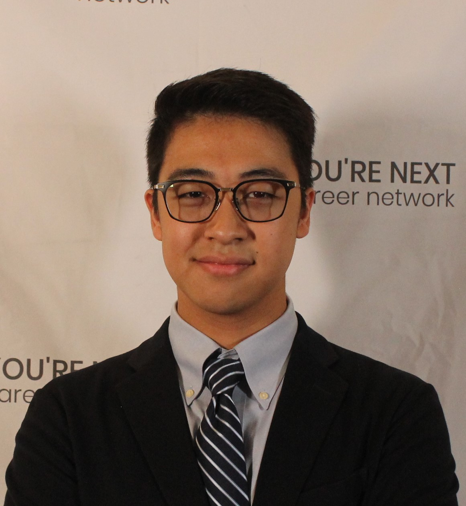

<!doctype html>
<html lang="en">
<head>
<meta charset="utf-8">
<meta name="viewport" content="width=device-width, initial-scale=1, viewport-fit=cover">
<link href="/img/favicon-32x32.png" rel="icon" sizes="32x32">
<link href="/img/favicon-192x192.png" rel="icon" sizes="192x192">
<link href="/img/favicon-297x297.png" rel="apple-touch-icon-precomposed">
<meta content="/img/favicon-297x297.png" name="msapplication-TileImage">
<title>
        
       Charles Liu
         | Software Engineer
    </title>
<meta name="description" content>
<meta name="google-site-verification" content="bzTP6T7_iPqdsTPB1KIMbC5z7GXwvXKbcedNpY">

</head>
<body>

<header class="header">

<a class="logo" href="https://chaliuu.github.io/">
<picture>

</picture>

Charles Liu

</a>

<a class="logo" href="https://chaliuu.github.io/">

Charles Liu

</a>
<nav class="menu">
    <a class="menu__item " href="CharlesLiu_Software_Developer_Intern_Resume.pdf">
    Resume
    </a>
</nav>

</header>

<section class="mb-huge">

<h1>
👋 Hi, I'm Charles.
</h1>

I'm an aspiring software engineer currently studying at the University of Toronto for a Computer Engineering Major and a Minor in Artificial Intelligence Engineering. My main interests are the combination of machine learning, web development and embedded/IoT firmware. My preferred tools are Python, C/C++, and JavaScript (React/Node). I am a creative problem-solver that love to diverge and explore unconventional solitions. I am a collaborative team member that strives to bring the most out of my teammates when solving problems together. In my spare time I enjoy playing basketball,
obsessively reading wikipedia and building my own projects. 

I'm on <a href="https://github.com/chaliuu" target="_blank">GitHub</a> and <a href="https://www.linkedin.com/in/charles-ch-liu/" target="_blank">LinkedIn</a>.

</section>
<footer class="footer">

&copy; 2023Charles Liu.

</footer>

</body>
</html>

